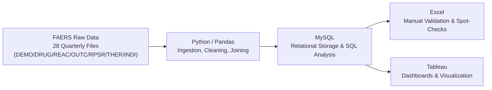

# FAERS 2025 Adverse Drug Event Analysis

**An end-to-end data analytics pipeline analyzing FDA Adverse Event Reporting System (FAERS) data — from raw ASCII extracts to production-grade dashboards.**

`Python` `Pandas` `NumPy` `MySQL` `Excel` `Tableau`

---

## Project Overview

The FDA's Adverse Event Reporting System (FAERS) collects post-market safety reports for drugs and biologics submitted by manufacturers, healthcare professionals, and consumers. This project processes all four 2025 quarterly extracts (7 file types × 4 quarters, **1,617,313 unique reports** and **7,469,819 drug entries** after cleaning) into a fully reproducible pipeline that answers 13 core pharmacovigilance questions — demographic patterns, reporting-lag behavior, drug- and reaction-level signal detection, and outcome severity — and presents them as interactive dashboards.

The project was built as a complete, real-world data analytics workflow: **Python (ingestion & cleaning) → MySQL (relational storage & SQL analysis) → Excel (manual validation) → Tableau (visualization)** — deliberately mirroring how this kind of analysis is actually structured in industry, rather than treating each tool as an isolated exercise.

---

## Business Questions Answered

| # | Question |
|---|---|
| 1 | Age-group and gender distribution of ADR reports |
| 2 | Reporting lag: event onset to FDA receipt |
| 3 | Reporting lag: event onset to manufacturer notification |
| 4 | Which countries generate the highest report volume, and how concentrated is it? |
| 5 | Which drugs (by active ingredient) account for the highest reporting volume? (Pareto) |
| 6 | What proportion of top-drug reports are linked to serious outcomes? |
| 7 | Which drug-reaction pairs show the strongest disproportionate reporting signal? (PRR/ROR) |
| 8 | What is the most common real indication for the top-reported drugs? |
| 9 | Which reactions are most frequently linked to serious outcomes? |
| 10 | Which countries have the highest death rate (not raw count) among reports? |
| 11 | Does report source correlate with outcome severity? |
| 12 | Is there a relationship between therapy duration and outcome severity? |
| 13 | For top drug-reaction pairs, what proportion show positive dechallenge/rechallenge? |

---

## Tech Stack & Methodology

- **Ingestion & Cleaning (Python / Pandas / NumPy, Google Colab):** raw `$`-delimited ASCII files loaded with explicit dtype control, date parsing with granularity tracking, age normalization, duplicate-report resolution, therapy-duration derivation with a documented plausibility floor, and full missingness auditing at every stage.
- **Joining:** purpose-built joined tables at the grain each question requires (report-level, drug-level, reaction-level, etc.) — **deliberately avoiding one all-in-one merge**, since naively joining all 7 source files would fan out combinatorially (a report with N drugs × M reactions produces N×M duplicate-looking rows). The one genuinely combinatorial join (drug-reaction pairwise counts for Q7/Q13) is built fresh, aggregated immediately, and never materialized as a standing table.
- **Signal Detection:** Proportional Reporting Ratio (PRR) and Reporting Odds Ratio (ROR) computed from 2×2 contingency tables, with signals flagged using the literature-standard **Evans et al. (2001) criteria** (PRR ≥ 2, chi-square ≥ 4, minimum case count).
- **MySQL:** all base and result tables loaded and indexed; the 13 questions are also independently reproduced as pure SQL — CTEs, window functions (`ROW_NUMBER`, `RANK`), `HAVING`-based thresholds, and a full contingency-table PRR/ROR calculation — as a second, cross-validated path to the same answers.
- **Excel:** used for targeted manual validation rather than as a primary cleaning tool — notably, **manually cross-validating the #1 PRR/ROR signal against raw contingency-table counts surfaced a genuine data-quality bug** (see below), which was then traced, fixed, and re-verified.
- **Tableau:** 13 individual visualizations across 3 thematic dashboards, each chart type selected deliberately for the shape of its underlying question (histogram, Pareto, forest plot, choropleth map, dumbbell chart, Cleveland dot plot, and clustered/trend charts) rather than defaulting to bar charts throughout.

---

## A Real Bug, Found and Fixed

During manual Excel validation of the top PRR/ROR signal, the co-occurrence count came back **larger than the total number of reports containing the drug at all** — mathematically impossible. Root cause: reports where the same active ingredient appeared more than once (e.g. as both a primary and secondary suspect entry) were being counted multiple times in the numerator while the denominator counted the report only once. The fix — deduplicating to one row per `(primaryid, drug_label)` with OR-aggregated causality flags before aggregation — was applied consistently across Q6, Q7, and Q13, re-verified in Excel, and re-propagated through MySQL and Tableau.

This is documented here deliberately: catching and correctly fixing a real double-counting bug through independent manual verification is a more meaningful demonstration of analytical rigor than a pipeline that never gets checked against anything outside itself.

---

## Dashboards

### Dashboard 1 — Demographics & Reporting
*(Q1 – Q4: age/gender distribution, reporting lag, country concentration)*

https://public.tableau.com/app/profile/shivani.sivaprakasam/viz/Dashboard1_17889333032730/Dashboard1_Demographics_Reporting

### Dashboard 2 — Drug-Level Analysis
*(Q5, Q6, Q7, Q8: top drugs, serious outcome rates, PRR/ROR signals, top indications)*

https://public.tableau.com/app/profile/shivani.sivaprakasam/viz/Dashboard2_17889333693810/Dashboard2_Drug_Analysis

### Dashboard 3 — Reaction & Outcome Analysis
*(Q9 – Q13: top reactions, country death rate map, reporter source, therapy duration, dechallenge/rechallenge)*

https://public.tableau.com/app/profile/shivani.sivaprakasam/viz/Dashboard3_17889337672830/Dashboard3ReactionOutcomeAnalysis

---

> **Note on data files:** raw FAERS extracts and the full cleaned/joined CSV exports are not committed to this repository — several exceed hundreds of megabytes, which is standard practice to exclude from version control. Source files are publicly available directly from the FDA (link below); the notebook reproduces the full pipeline from that raw data.

---

## Data Source

FDA Adverse Event Reporting System (FAERS) Quarterly Data Extracts, 2025 Q1–Q4.
Publicly available at: https://www.fda.gov/drugs/questions-and-answers-fdas-adverse-event-reporting-system-faers/fda-adverse-event-reporting-system-faers-quarterly-data-extract-files

---

## Key Data Limitations (Documented, Not Hidden)

- **Event date coverage:** `event_dt` is missing/unparseable for ~56% of reports, meaning reporting-lag calculations (Q2, Q3) are only computable for the subset where it was recorded — a known, common FAERS gap, not a processing error.
- **Report source coverage:** the RPSR file covers only ~2.7% of all reports; Q11's findings describe the reports that *do* specify a source, not the full population.
- **Rechallenge data sparsity:** positive rechallenge is recorded on well under 1% of drug entries — inherent to how rarely a suspected-harmful drug is deliberately re-administered, not a data-quality flaw.
- **Concentration, not "least-reported":** volume-based questions (Q4, Q5, Q9) are intentionally framed as Pareto/concentration analyses rather than ranking the *least*-reported entities, since FAERS has no reliable exposure denominator to support that framing.
- **PRR/ROR statistical fragility:** disproportionality ratios computed from small marginal counts can be extreme even when correctly calculated; a minimum case-count threshold above the bare Evans criteria was applied specifically for the Q7 ranking to avoid a "top signal" driven by 3-report pairs.
- **Administrative MedDRA codes:** entries like "Off Label Use," "Drug Ineffective," and "Product Used for Unknown Indication" are FAERS administrative codes, not clinical reactions or indications — flagged and excluded/caveated where they would otherwise distort a ranking (Q8, Q9, Q13).
- **Excluded fields:** `rept_cod`, `drug_rec_act`, and `wt` were excluded from the working dataset — none are used by any of the 13 questions, and each was reviewed individually before exclusion (see pipeline notebook for full column-trimming rationale).

---

## Skills Demonstrated

- End-to-end pipeline design across 4 distinct tools, with deliberate handoffs rather than isolated exercises
- Data cleaning at scale: date parsing with precision tracking, plausibility filtering with documented thresholds, duplicate resolution with full-row vs. key-based distinction
- Combinatorial-join risk management (avoiding accidental row fan-out on multi-table joins)
- Pharmacovigilance-specific statistical methods: PRR, ROR, 2×2 contingency tables, Evans signal-detection criteria
- SQL: CTEs, window functions, `HAVING`-based aggregate filtering, query optimization for large joins (indexing, staged temp tables)
- Independent cross-validation of automated results (catching a real bug via manual Excel verification)
- Chart-type selection matched deliberately to data shape rather than defaulting to one visualization type
- Clear, honest documentation of every methodological limitation, rather than presenting results without caveats

---

## Author

**Shivani**
B.Tech Biotechnology, 2026

---

*This project uses publicly available FDA FAERS data. All analysis, cleaning decisions, and visualizations are original work.*
